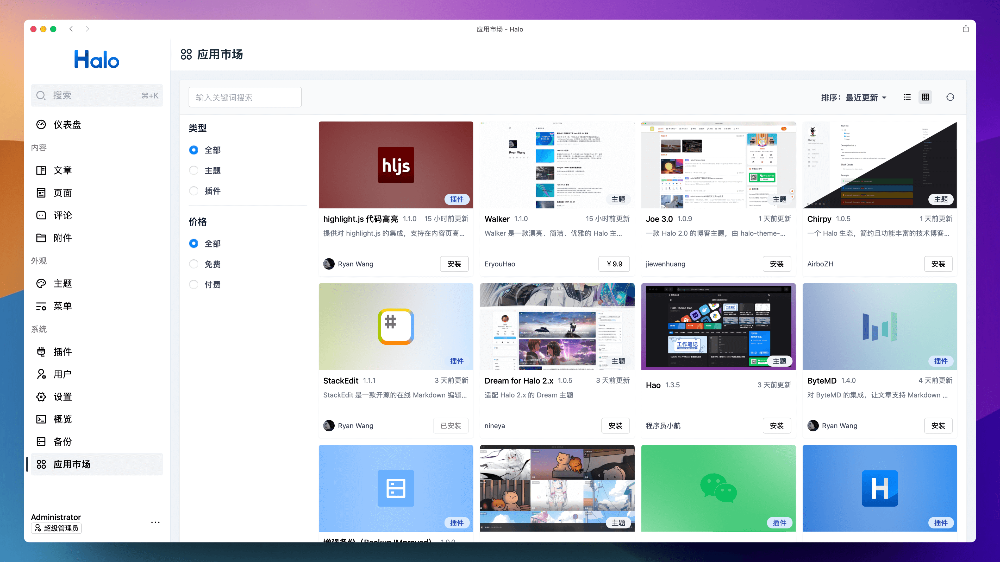
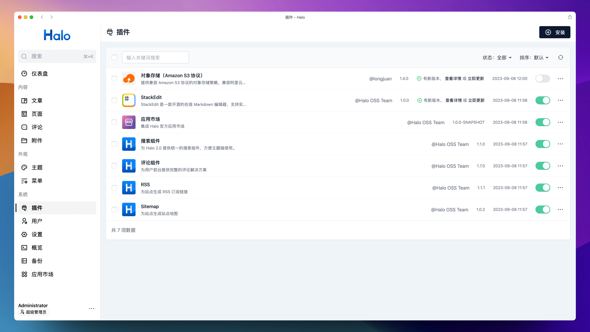
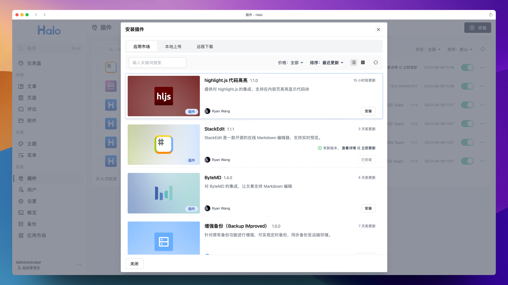
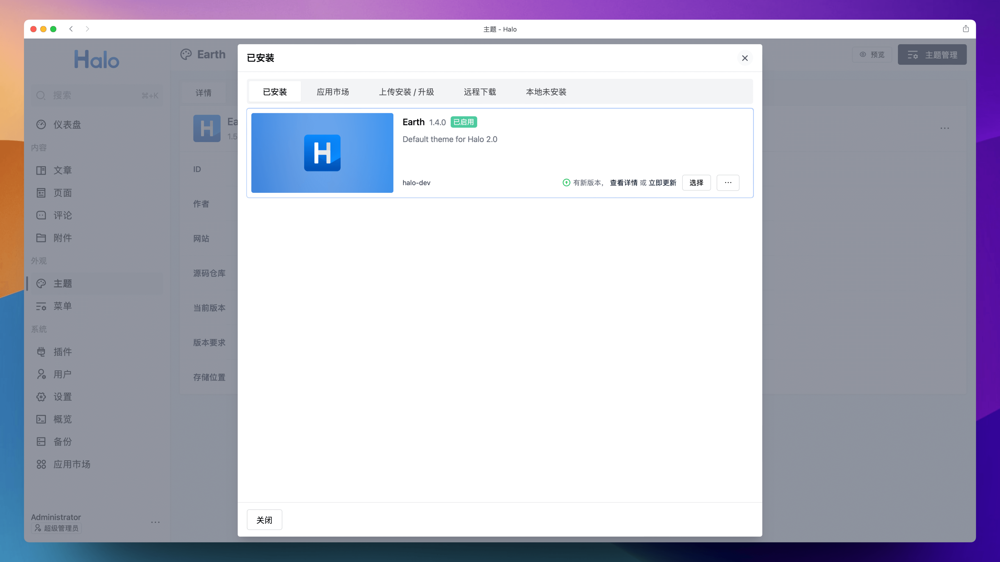
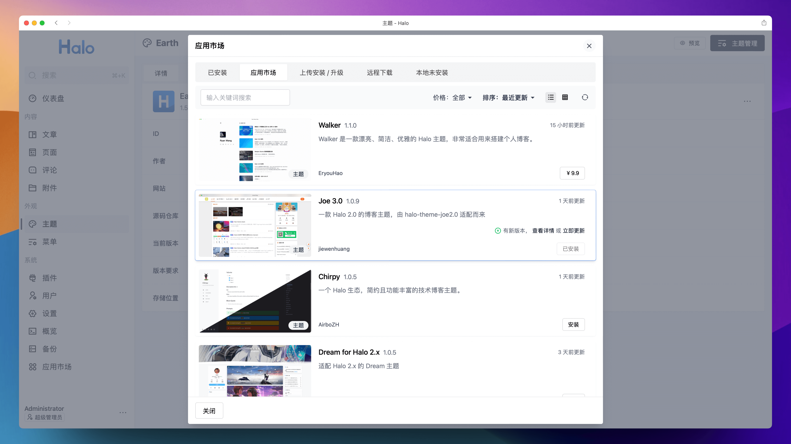

# 应用市场

Console 集成 Halo 官方应用市场，支持下载、检测更新、升级主题和插件。

## 特性

- 为主题和插件的安装界面添加应用市场的入口，可以直接进行安装。
- 支持在插件和主题的管理列表检测新版本并升级。
- 提供统一的应用市场页面。

## 使用方式

1. 下载，目前提供以下两个下载方式：
    - GitHub Releases：访问 [Releases](https://github.com/halo-dev/plugin-app-store/releases) 下载 Assets 中的 JAR 文件。
    - Halo 应用市场：<https://halo.run/store/apps/app-VYJbF>
2. 插件安装和更新方式可参考：<https://docs.halo.run/user-guide/plugins>
3. 此插件的后续更新也可以直接在应用市场中进行更新。

## 后续计划

- [ ] 支持绑定 Halo 官网的账号，方便下载和更新已付费的应用。
- [x] 支持在应用市场页面查看已安装的应用。

## 注意事项

目前首次安装此插件后，并不会检测目前已有的插件和主题的更新，这是因为只有从应用市场下载的插件和主题才会设置安装来源。所以，如果需要检测已有插件和主题的更新，需要在应用市场重新安装一次插件和主题。

此机制是为了保证网站已有的插件和主题存在于应用市场，防止出现已安装的主题和插件与应用市场的主题和插件不一致的情况。

## 预览

